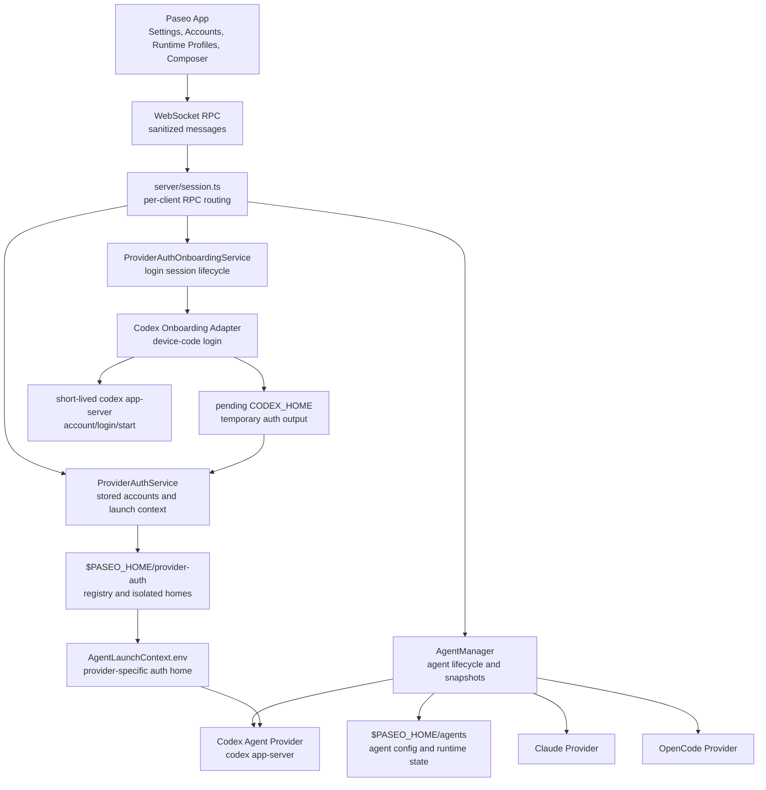
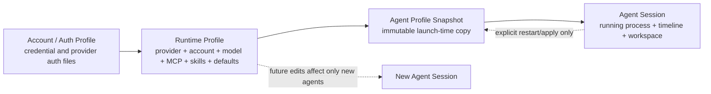
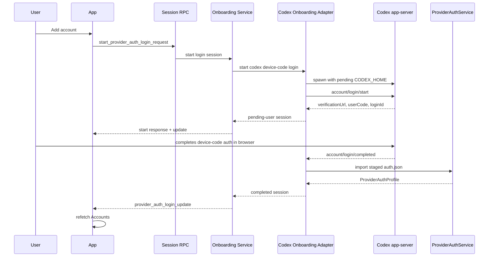
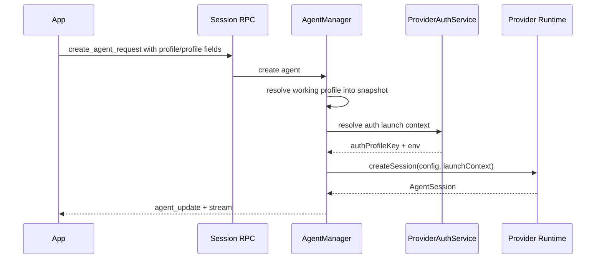
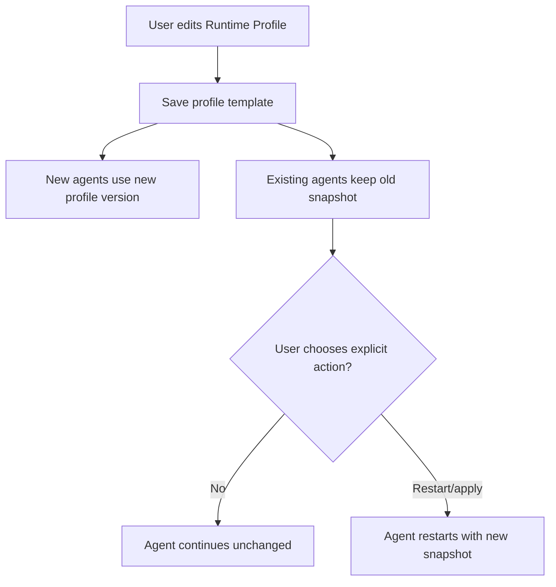

# Provider Auth Onboarding Architecture Dossier

Status: target architecture for the implemented layer; not yet implemented
Related plan: [provider-auth-onboarding-plan.md](./provider-auth-onboarding-plan.md)
Canonical final plan:
[provider-runtime-profiles-final-plan.md](./provider-runtime-profiles-final-plan.md)
Base architecture: [architecture.md](./architecture.md)

## One-Line Identity

Provider auth onboarding is the native Paseo sub-layer that creates provider
accounts from inside the app, then hands those accounts to the runtime profile
and launch snapshot system.

It is not the agent runtime. It is not automatic account rotation. It is the
account creation and pairing layer that feeds the runtime profile and agent
session layers.

## Working System Picture



## Product Model



### Account / Auth Profile

Owns only identity and credentials:

- provider id;
- account key and safe metadata;
- isolated provider home path;
- auth mode;
- readiness and refresh state;
- usage snapshot when available.

It must not own model, MCP, skills, permissions, or workspace defaults.

### Runtime Profile

Product layer that combines account plus runtime defaults:

- provider;
- auth account;
- model and reasoning effort;
- MCP server set;
- skill set;
- instruction overlays;
- permissions and feature defaults;
- environment/config overlays;
- workspace defaults;
- concurrency policy.

It is a mutable template for future sessions.

### Agent Profile Snapshot

Immutable copy written when an agent starts or is explicitly restarted:

- source profile id/version if available;
- resolved provider and account;
- resolved model, reasoning, MCP, skills, instructions, permissions;
- env/config overlays;
- any provider launch metadata.

Running agents depend on this snapshot, not on the live profile template.

### Agent Session

Runtime state:

- provider child process;
- workspace/cwd;
- visible timeline;
- provider persistence handle;
- current status and permissions;
- selected launch snapshot.

Profile edits never silently mutate this running state.

## Backend Künye

| Layer                     | Primary files                                     | Owns                                             | Does not own                        |
| ------------------------- | ------------------------------------------------- | ------------------------------------------------ | ----------------------------------- |
| WebSocket protocol        | `packages/server/src/shared/messages.ts`          | Additive RPC schemas and public payloads         | Secrets, provider process handles   |
| Session router            | `packages/server/src/server/session.ts`           | Request routing, response/update emission        | Provider-specific login internals   |
| Onboarding service        | `provider-auth-onboarding-service.ts`             | Login session lifecycle, timeout, cleanup        | Permanent profile launch semantics  |
| Codex onboarding adapter  | `provider-auth-codex-onboarding.ts`               | Codex app-server auth flow, staging `CODEX_HOME` | App UI, global Codex auth mutation  |
| Auth profile service      | `provider-auth-service.ts`                        | Stored accounts, defaults, launch context        | Long-running login session UI state |
| Codex auth adapter        | `provider-auth-codex.ts`                          | `auth.json` parsing/import, isolated home        | Device-code lifecycle               |
| Shared JSON-RPC transport | `providers/codex-app-server-json-rpc.ts`          | Child process JSON-RPC request/update plumbing   | Codex auth business rules           |
| Agent manager             | `agent-manager.ts`                                | Agent lifecycle, restart, launch snapshots       | Raw token storage                   |
| Codex provider            | `providers/codex-app-server-agent.ts`             | Running Codex agent process                      | Account creation UX                 |
| Storage                   | `$PASEO_HOME/provider-auth`, `$PASEO_HOME/agents` | Profile records, isolated homes, agent snapshots | Global provider credential mutation |

## Frontend Künye

| Surface                  | Primary role                    | Expected behavior                                                                |
| ------------------------ | ------------------------------- | -------------------------------------------------------------------------------- |
| Provider Settings        | Account management              | Show accounts, add account, import current fallback, default, refresh, remove    |
| Add Account Sheet        | Onboarding ceremony             | Show device code/link, pending state, cancel, error, completed state             |
| Provider Profiles        | Future runtime-template manager | Edit provider/account/model/MCP/skills/defaults for future sessions              |
| Composer Preferences     | Per-agent launch selection      | Select account/profile for new agents, no login ceremony unless linked out       |
| Active Agent Preferences | Controlled runtime changes      | Explicit restart/apply actions, no silent mutation after profile edits           |
| Profile conflict warning | Concurrency risk communication  | Warn when same auth account/profile is already active if policy asks for warning |

## Runtime Flows

### Add Codex Account



### Start Agent From Runtime Profile



### Edit Runtime Profile While Agent Runs



## State Ownership

| State                         | Lifetime       | Owner                   | Visible to app |
| ----------------------------- | -------------- | ----------------------- | -------------- |
| Login session status          | Minutes        | Onboarding service      | Yes, sanitized |
| Pending provider home         | Minutes        | Onboarding adapter      | No             |
| Provider account credentials  | Long-lived     | Provider auth service   | No             |
| Public account metadata       | Long-lived     | Provider auth service   | Yes            |
| Working profile template      | Long-lived     | Future profile service  | Yes            |
| Agent profile snapshot        | Agent lifetime | Agent manager/storage   | Yes, sanitized |
| Provider child process handle | Runtime only   | Provider client/session | No             |
| Provider timeline             | Agent lifetime | Agent manager/storage   | Yes            |

## Storage Picture

```text
$PASEO_HOME/
  provider-auth/
    registry.json
    codex/
      pending/
        <loginSessionId>/
          codex-home/
            auth.json              # temporary, never exposed
      profiles/
        <authProfileKey>/
          codex-home/
            auth.json              # permanent isolated credential home
            config.toml
          profile.json             # provider-private metadata if needed
  runtime-profiles/
    profiles.json                  # runtime profile templates
  agents/
    <workspace>/
      <agentId>.json               # agent config + launch snapshot + runtime state
```

## WebSocket Boundary

Allowed over RPC:

- login session id;
- provider id;
- login method;
- status;
- verification URL;
- user code;
- safe error text;
- public profile metadata;
- selected profile/account keys;
- sanitized agent snapshot metadata.

Forbidden over RPC:

- access tokens;
- refresh tokens;
- raw `auth.json`;
- API keys;
- JWT payloads;
- staging paths;
- provider home paths;
- child process handles;
- full provider stderr when it may contain secrets.

## Concurrency Semantics

| Scenario                                 | MVP behavior                          | Future hardening                       |
| ---------------------------------------- | ------------------------------------- | -------------------------------------- |
| Different accounts, different agents     | Allow                                 | Allow                                  |
| Same working profile, multiple agents    | Allow or warn                         | Policy-driven                          |
| Same auth account, multiple agents       | Warn if observable                    | `allow`, `warn`, or `single-active`    |
| Active agent account change              | Explicit restart only                 | Same                                   |
| Profile template edited during run       | Existing agent unchanged              | Optional explicit apply/restart action |
| Provider refresh-token conflict detected | Show provider error, no auto fallback | Account/profile lease coordination     |

## Failure Semantics

- Cancelled login leaves no usable partial profile.
- Expired login stops child process and removes pending home best-effort.
- App disconnect does not lose an active login session until timeout or
  terminal state.
- Duplicate account login updates the existing auth profile.
- Failed import does not corrupt existing profiles.
- Failed cleanup logs a warning but keeps a successfully imported profile.
- Failed active-agent restart leaves the old agent usable.

## Implementation Boundaries

First implementation should include:

- native Codex device-code account onboarding;
- onboarding service and Codex adapter;
- additive WebSocket RPCs;
- app Add Account flow;
- current provider auth profile storage/selection reuse.

First implementation should not include:

- full runtime profile editor;
- automatic account rotation;
- provider-wide concurrency lock enforcement;
- Claude/OpenCode/Pi onboarding;
- browser callback login unless separately proven safe;
- API-key secret-entry UX unless separately designed.

## Validation Picture

Automated targeted validation:

- JSON-RPC transport unit tests;
- onboarding service fake-adapter lifecycle tests;
- Codex onboarding adapter tests with fake app-server;
- message schema tests for new additive RPCs;
- daemon-client request/response tests;
- app hook/component tests for Add Account state if local patterns exist;
- `npm run format:files -- <changed files>`;
- `npm run lint -- <changed files>`;
- `npm run typecheck`.

Live validation:

1. Add a new Codex account from Paseo using device-code login.
2. Confirm the profile appears without external CLI login.
3. Set the new account as default.
4. Start a new Codex agent with the account.
5. Start another agent with a different account.
6. Edit any future working profile template and confirm existing agents keep
   their launch snapshot.
7. Switch an existing agent through explicit controlled restart only.

## Final Architecture Rule

```text
Account/Auth Profile = credential record
Runtime Profile = mutable runtime template
Agent Profile Snapshot = immutable launch copy
Agent Session = running process and timeline
```

This keeps account onboarding native, profile configuration composable, and
running agents predictable.
